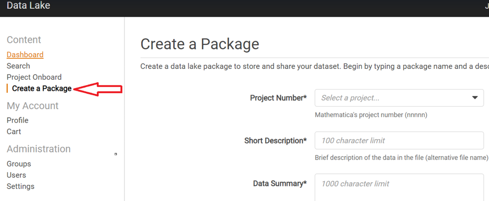
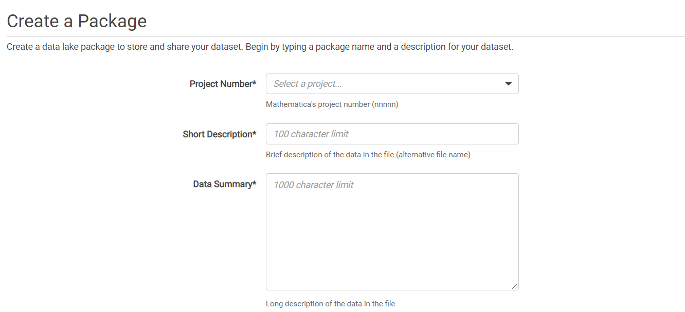
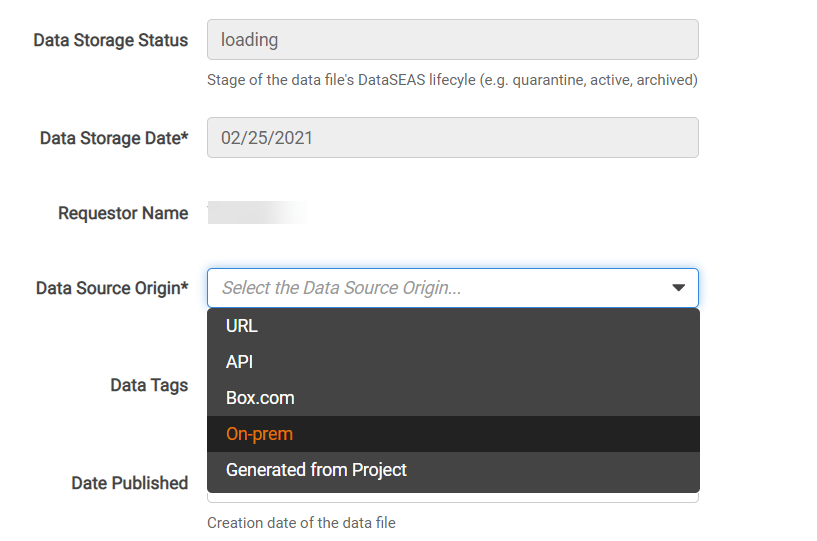
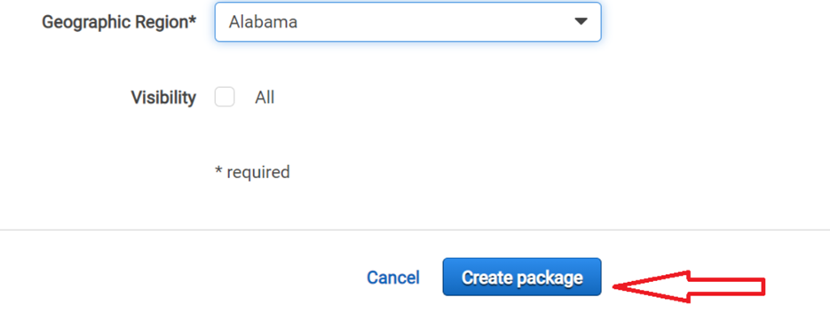
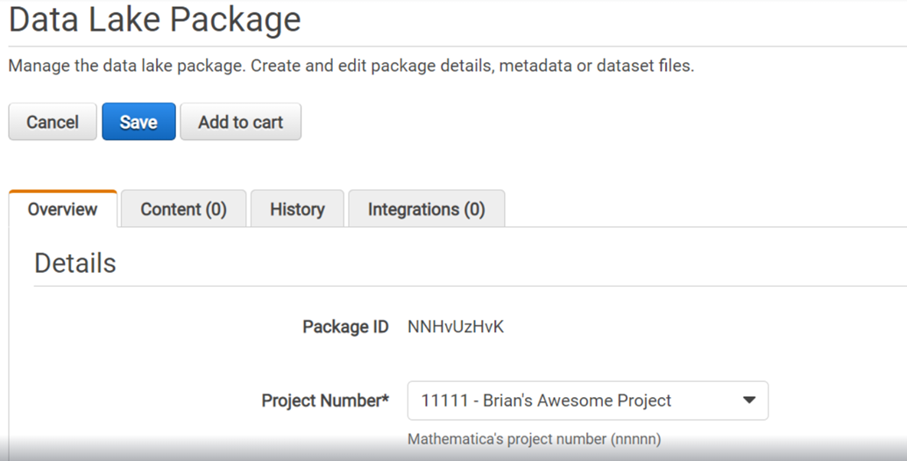
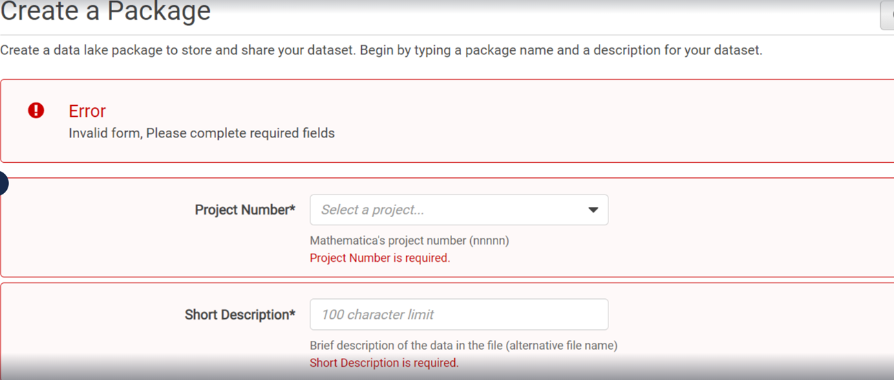
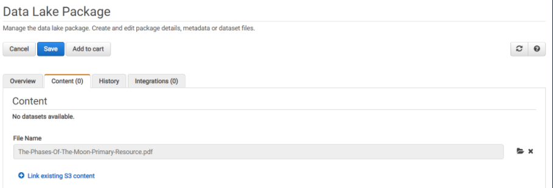
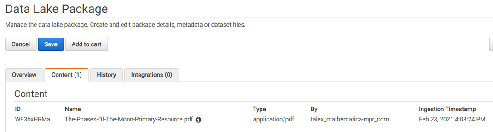
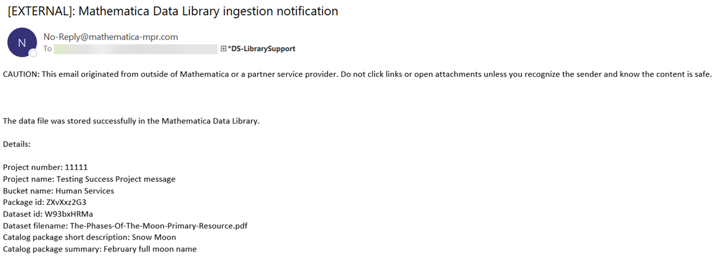

# Creating packages

Consider **packages** as containers to store the datasets (a file or a collection of files) from different sources.  Tags, metadata added to packages help to catalog the datasets and make them discoverable, accessible to the project users in the library. You can create multiple packages to store different versions of the data or categories of data.

> Project system leads, project data users can create packages to ingest datasets. You can upload only one dataset file in a package.

> Contact DS-LibrarySupport@mathematica-mpr.com for any problems with package creation to upload a dataset.

#### To create a package: 

* Click **Create a Package** tab or the **Create Package** button in the Dashboard page to upload metadata.
    * Note that project System Leads are automatically directed to the package creation page when setting up a project in the library.
   
   
* Select the project number associated with the package. **Note to select the project that you are part of.**

#### Catalog the package:

* Enter the required fields to provide information on the package, such as the description of the dataset, focus area, data classification, data source. 

> Provide a detailed data summary - so the package (dataset) queries help users understand the datasets in the data library.

   
* We recommend you provide information for all the fields in the package creation page. Cataloging the packages allow for 
    * consistent way to categorize, locate the datasets using the Search feature.
    * view the list of datasets in the data library, and identify the datasets available to public, or are private.

> In the MVP implementation of the Data Library, only on-premise location works for uploading datasets. Though you see the different data source origin, select *On-prem* as the Data Source Origin.

    
* By default, the library assigns an initial version number to the package you create. You can add new version comments to the **Data Version Comment** when updating the package. 
* Click **Create Package**. 
    
* On successful creation, you see the package details in the **Overview** page and can add a file to build the package contents.
    
* If the package creation page displays an error (due to missing required fields or fields with invalid data types), enter the required fields and click **Create Package** again to re-submit the form.
    

<!--Add metadata:

* In the Overview tab where you see the package details, scroll down to the bottom, and click **Add Metadata**.
* Enter the tag name and value.
* Add as many metadata tags as needed.
* To edit an existing tag, select the tag/value and enter the new name/value.

-->

Add dataset file:

> For details on what data files can be ingested, refer to the [Data Ingestion Requirements](dataingestion_requirements.md)

* To upload data file for the dataset, select the **Content** tab at the top of the package page.
* Click **Publish a local file**.
* Click the folder icon at the right to browse and upload the file. If you accidentally uploaded a wrong data file, click X next to the folder icon to cancel the file selected, then select the correct data file to upload. 
    
* Click **Save** at the top of the page to save uploading the file.
* On the completion of the file uploading, you see the file in the **Contents** tab.
    
* You will also receive an email about the data file ingestion, including the file details and the S3 bucket where the dataset is stored.
    

> You will see the file uploaded in the Content tab even if the ingestion process was a failure because of an invalid file type. Email notifications indicate whether the file ingestion process was a success or a failure. The Data Storage Status in the package overview automatically updates to display “Active”  status when the file upload's successful and stored in the unit storage bucket. The status changes to "Quarantine" for a file upload failure and the file's in the quarantine bucket.

See below for the metadata field descriptions:

| Field Name | Description |
|------------|--------------|
| Project Number | Mathematica's project number. |
| Short Description | The package name that displays on searching - a brief description of the data in the file (alternative file name).|
| Data Summary | Detailed description of the data in the file. The description is displayed when you search for packages. |
| Data Purchased | Indicates if the data file was purchased from an outside source, and to identify the data license agreements.  |
| Aggregation Level | Indicates how each row in the data file is uniquely identified (e.g. Beneficiary, Provider) |
| Focus Area | Indicates the Mathematica focus area represented in the data file. |
| Data Use | Indicates the intended use of the data file for the project. This designates the data files as TEST or PROD to differentiate between development and production data.  |
| PII/PHI | Indicates if the data file contains any PII/PHI data elements. |
| Data Classification | Indicates the security access level of the data file, and to limit the visibility of the package to the appropriate audience. |
| Data Storage Status| The status of the data file in the package. The status is first set to “Loading” to indicate the data file is to be uploaded. On the file upload, the status changes to "Active" to indicate the data file is stored in the project bucket or "Quarantine" for the data file stored in the quarantine bucket. |
| Data Storage Date | The date the package is created. |
| Requestor Name | The name of the package creator. |
| Data Source Origin | The source location of the data file. For the MVP implementation, you upload the data file from the on-premise data source | 
| Data Tags | One or two-word tag for categorizing the data file (e.g., Inpatient Claims, COVID-19). | 
| Date Published| The creation date of the package. | 
| Data Version Comment| Brief description of the version of the data file. New comments are added for each update to the package such as editing package details, or uploading a dataset. | 
| Data Source Years: Start Year, End Year| Time span represented in the data file in year format. |
| No Data Source Years Apply| Indicates the time span is not applicable to the data file. |  
| Geographic Region| US State or US Region represented in the data file. | 
| Visibility| A check to indicate the package is visible to all in the data library. | 

