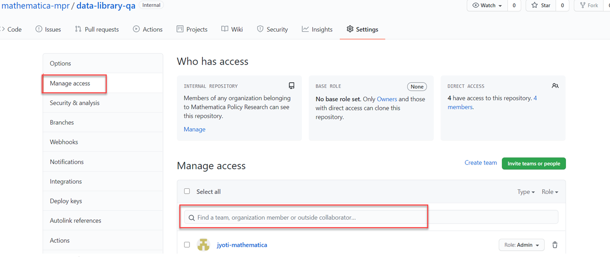

# Using GitHub repository for project work

Project lead creates a project repository to store all scripts for the data processing. 
Click New button in the mathematica-mpr page to create a repository and set the repository as either internal or private repository.

For details on how to work on a GitHub repository, see the documentation at https://guides.github.com/activities/hello-world/

Once you create a repository, add your project team as users with write permission. To add users, 

* Select your repository and click Settings at the top of the page.
* Click Manage Access, and in the search bar, type the project team member names to add them to the repository. Assign the appropriate role to the members.
    

Use the main branch to store the common project files. Use branches to develop your program scripts and merge them to the main branch once it's ready to use by the project. For information on how to create branches, see the documentation at https://docs.github.com/en/github/collaborating-with-issues-and-pull-requests/about-branches.