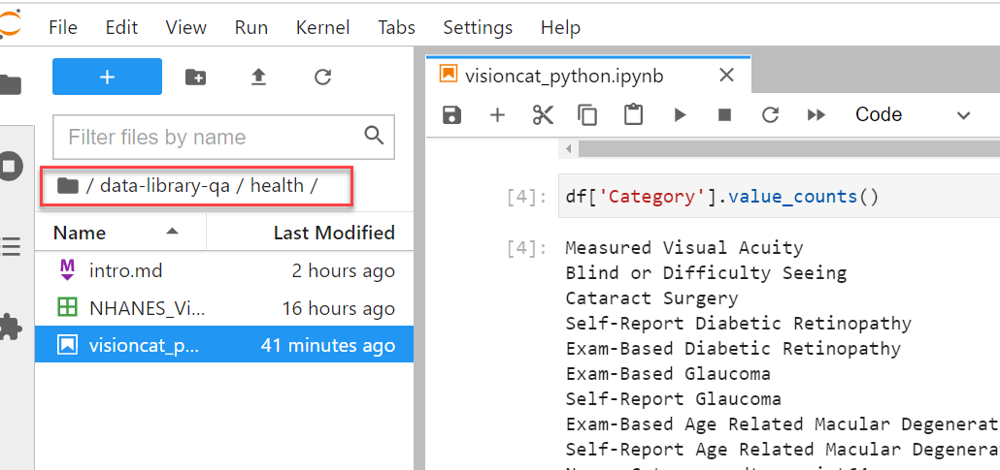

JupyterHub Interface

A JupyterHub configured for each project allows for project users to collaborate on the data processing without worrying about installation of the processing languages.

The JupyterHub configuration includes Python, R, Stata languages for data analysis - and being a web interface, users can securely access the data from anywhere, on any machine with internet access (without logging into the Mathematica network).

The data science environment you see includes 

- **JuypterLab notebooks** (of ipynb type ): Documents that can include inputs and outputs of the computations and the resultant rich media representation, descriptive text (Markdown), equations, images. 
    The Python, R, Stata kernels for the notebooks let you run the code in the respective programming language.
- **Code consoles** : Consoles for Python, R, Stata to run code interactively in a kernel.
- **Terminal**: A bash shell terminal to run commands to view your files, copy files, etc.
- **Text, Markdown files**: Create text or markdown files. You can validate the code samples in your text documents by creating a console for the editor (right-click in the editor), highlighting the code to run (Shift + Enter) and view the result in the console.

The left sidebar in the hub includes the File Browser (list of files in your workspace), a list of running kernels and terminals (list of tabs open in the main area and the kernels). To learn more about the interface, see https://jupyterlab.readthedocs.io/en/latest/user/interface.html

The File Browser includes the options to create new folder or to upload files. Be mindful of your file location when trying to run the scripts.

## Understanding project data storage structure

Project datasets get stored in Health/Human Services/International unit S3 buckets depending on the project associated with the project unit  (association cataloged via the project onboarding form in the data library). Within a unit bucket, individual folders (identified by a package id) indicate a project data file. 

With JuypterHub access, you can access and process only the data files uploaded for your project even though you can see all the data files in the project unit bucket. To access your file using the JupyterLab, you need to know the 
* bucket (the project unit bucket name) and 
* key (the S3 path to the file in the bucket)

To get this file storage information, 

* Log into the Data Library application.
* Search by the project number to view the packages available for the project.
* Click the Edit Package icon next to the package.
* Click the **Content** tab to see the name, type of the data file that's uploaded to the S3 bucket. 
* Do a mouse hover on the info icon next to the file name - this shows the S3 path of the file.
    * To retrieve the S3 path information, click **Add to Cart** at the top of the page.
        
    * Click **Cart** under My Account - you see the package's added to your cart.
        
    * Click **Generate Manifest** at the top of the my cart page.
        
    * Select Amazon S3 Bucket/Keys option in the manifest dialog window, click **Generate**.
    * My Manifest tab would now include the manifest file for the package. Click the Refresh button at the top of the page if you don't see the manifest generated.
    * Click the download link to download the manifest. Note that this link to download expires after four hours.
        
    * Open the downloaded JSON file to see the bucket and key of the package.

## Working with your data files

As a best practice, we recommend project teams use a GitHub repository as a central host to add their data processing code and local versions of the data file. Mathematica has a GitHub organization account (mathematica-mpr account), and project teams can create a repository in this account. 

JuptyerHub access would grant you access to the mathematica-mpr GitHub account. Project System lead create a repository in mathematica-mpr GitHub account for the project team. 

> Pre-requisite for mathematica-mpr GitHub account:  Project team should create a [GitHub account](https://github.com/join?ref_cta=Sign+up&ref_loc=header+logged+out&ref_page=%2F&source=header-home) with their Mathematica email address. Pass the credential information (username and the name of the person) to DS-LibrarySupport@mathematica-mpr.com when you first request to set up the project in the Data Library.

See Data Processing - Using GitHub repository for project work  for information on creating a repository.

### Retrieving the datafile from the S3 bucket to your project repository

Use either the AWS CLI or the AWS SDK for Python to retrieve the datafile.

#### Example 1: Using AWS CLI to access the S3 bucket

You can use AWS CLI command to access the AWS S3 bucket containing your project datafiles.

* In JupyterHub, click **File > New Launcher**.
* Click **Terminal** to open the terminal to add the scripts.
* To verify the datafile is in the project unit bucket, use the below script:
~~~
aws s3 ls s3://dev-data-lake-health-us-east-1-614303820618
~~~
* To download the datafile to JupyterHub (to analyze)

~~~
# download a file from the project unit bucket to local (JupyterHub)

aws s3 cp s3://dev-data-lake-health-us-east-1-614303820618/6qmsys8WB/SrPpTkSoR/1615231130067/NHANES_VisionHealth_Survey.csv .
~~~~

* Next, to clone your project GitHub repository to JupyterHub (to store your notebooks and script files) 
    * On the GitHub, navigate to your repository, click Code, copy the https github link.
        
    * In the terminal, use the git clone command and enter yout Github user credentials to start the cloning. 
    * Note that in the Juptyer terminal, the password prompt does not show the entered characters, but accepts them when you enter. You can also paste your password (Ctrl V) and hit Enter.
    * This action creates a copy of the repository in your JupyterHub space.

~~~
git clone <https://github.com/YOUR-REPOSITORY>
~~~

* Run any of the Python, R, Stata scripts on the local copy of the datafile to query/infer from the data
    * For example, Click Python 3 Notebook to write your Python scripts and save as a Juypter Notebook.
    * Use Shift-Enter or the Run command to run the scripts in a cell. Note the cell should be selected to run.
    * Name the notebook. Right-click the notebook and click Rename to name the notebook.
        
        
* Add the copy of the datafile and your scripts to the project GitHub. Sharing these with the data developers and analysts in your project help to present the data findings to a larger group (stakeholders, business analysts).
    * Copy the datafile and your scripts to the repository folder in your Jupyter space.
        
    * Next, use git commands to upload these files in the GitHub repository.
        
        
        
    * On GitHub, verify the files have been added to your repository.
        
    * Other project team members can use above steps to download your scripts to their JupyterHub environment.

> For MVP, users currently do not have sudo level permissions to install packages to the JupyterHub interface. Contact DS-LibrarySupport@mathematica-mpr.com to install packages of your choice.

#### Example 2: Using Python package Boto3

One method the data developers use to connect to AWS resources like S3 buckets is through the AWS Software Development Kit (SDK) for **Python**, called Boto3. R developers could try a package named Paws to connect to the S3 buckets. For more information, see https://www.r-bloggers.com/2019/10/an-amazon-sdk-for-r/ or 

* Click Python 3 Notebook to write your Python scripts and save as a Juypter Notebook.
* Use Shift-Enter or the Run command to run the scripts in a cell. Note the cell should be selected to run.
Name the notebook. Right-click the notebook and click Rename to name the notebook.
 
As an example, see below Python scripts to read the file, using Boto3:

~~~
# view all files in the project unit bucket

import boto3

s3 = boto3.resource('s3')
my_bucket = s3.Bucket('dev-data-lake-health-us-east-1-614303820618')

for object_summary in my_bucket.objects.filter(Prefix=""):
    print(object_summary.key)

# view a sample file (that a project user has access to) in the health bucket 
import boto3
import pandas as pd

s3_client = boto3.client('s3')
response = s3_client.get_object(Bucket="dev-data-lake-health-us-east-1-614303820618",Key="6qmsys8WB/SrPpTkSoR/1615231130067/NHANES_VisionHealth_Survey.csv")
file = response["Body"]
df = pd.read_csv(file, header=0, delimiter=",", low_memory=False)
df.columns
df.head(5)

~~~

