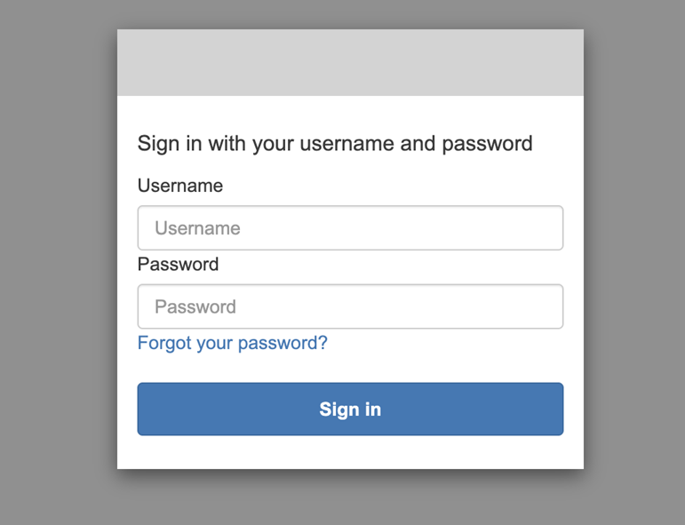
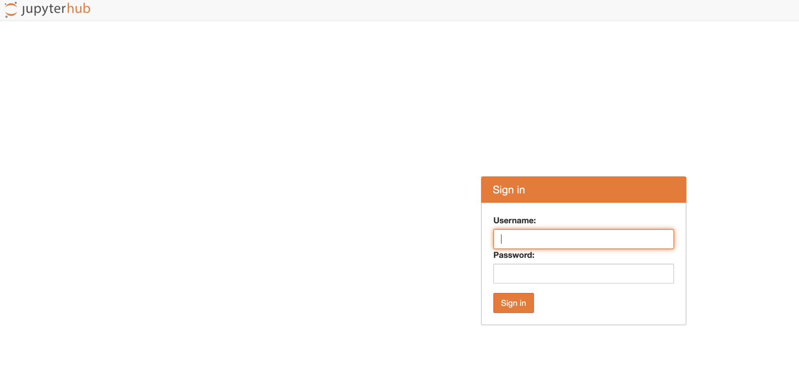
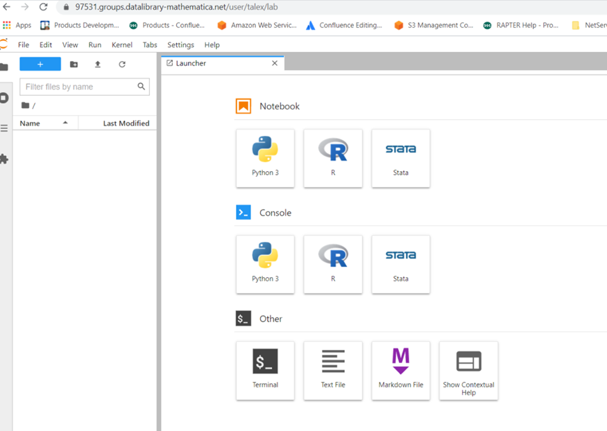

# Data processing through JuypterHub

While the library is the collection of datasets the data researchers can search to learn about the studies and the data sources that data scientists/researchers are using in their Mathematica studies, the JupyterHub web tool allows the scientists to analyze/process the data sources.

JupyterHub is a web based server instance for a project group to run calculations, research, collaborate on the project datasets (datasources) using Jupyter notebooks. The JuypterHub data science environment configured for the data library project groups includes Python, R, Stata languages for the users to do their data processing.

To log in,

* The JuypterHub workspace is configured for each project in the Data Library and requires the project number, the project unit (Health, Human Services, International), approximate storage capacity needed for the project data processing for the set-up. The project lead provides this information along with an approximate storage size required for the project's datasets and computation needs to the data librarian.
* The projects approved to access the Data Library will receive a separate email invitation to the JupyterHub. 
    * Note that the setting up the JupyterHub workspace for the project may take a couple of days longer than setting up the project access the Data Library to upload the datasets via packages. We recommend that project teams start adding the project details, uploading the datasets to the library and then wait for the JuypterHub email invitation to start processing the datasets within the project storage bucket.
* Signing in to the JuypterHub involves logging to two two UI consoles - AWS Cognito sign-in UI, and Jupyter sig-in UI.
* Click the JupyterHub URL link you receive in the email invitation. The URL is specific for each Data Library projects, and you see the project name in the URL.
   Note that you may receive two separate email invitations for the Jupyterhub, one with Cognito user name and temporary password credentials, and another email with Jupyter user name and password credentials.
 
   
   
   > Save this email with the JuypterHub credentials - it takes a week before the JuypterHub allows the user to change the password in its terminal.
* Click the URL to the JupyterHub, and enter the user name and the temporary password provided in the Cognito UI page that appears. Click **Sign in**.
    
* Change the temporary password - enter a new password for the Cognito sign-in page. This action then redirects you to the JupterHub sign-in page. 
* Enter the user name, the JupyterHub password credentials as provided in the email invitation and click **Sign in**. 
    
* You now see the JuypterHub workspace configured for your project.
   

> Bookmark the JuypterHub URL.

Note that Cognito and JupyterHub login credentials are separate, and you have to use the password credentials as provided in the email invitation for logging to the JupyterHub.  To change the JupyterHub password, wait for a week before attempting to do so in the JupyterHub console. Use `passwd` command in the terminal to change the password.
