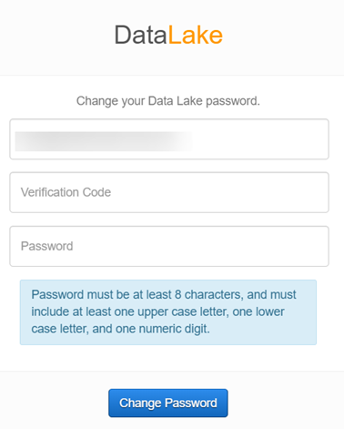

# Logging in

1. Navigate to the Data Library application URL, https://awsstg.datalibrary-mathematica.net/ 
2. Enter your Mathematica email address.
2. Enter your password and click **Sign In**. 
    
    If this is your initial login, enter the temporary password that you received via an email invite. Create a user password for the application, and click **Set Password**. 
    
3. The data library Dashboard displays the options to create a package, the search field to search for data sets, and the count of packages visible to the user.

> Project System Leads can add project details to catalog the project datasets. The data developers, researchers in a project create packages to add metadata, ingest datasets from On-prem data sources.

### To recover your password

1. If you forget the password to the Data Library application, click **Forgot password** link on the sign-in page.
    
2. Enter your email address and click **Reset Password**. 
    
3. You will then receive a verification code to reset your password. Enter this code, a new password to the library, and click **Change Password** on the password change page.
    
    
4. Sign in to the library using the email address and the new password.

### To change your password

All Data Library users can change their password from within the application.

1. In the Data Library application, under My Account, click **Profile**.
    
2. Click Change Password and then enter your old password, new password on the password change page. Click **Change Password** to reset the password.

