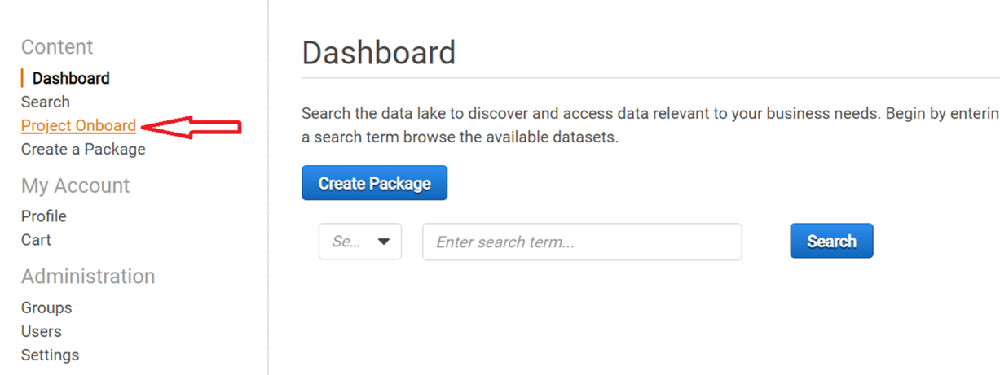
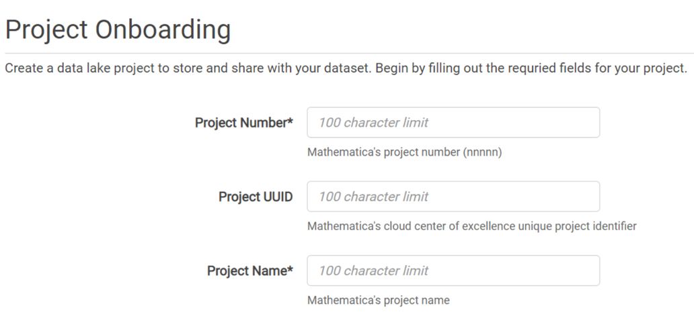
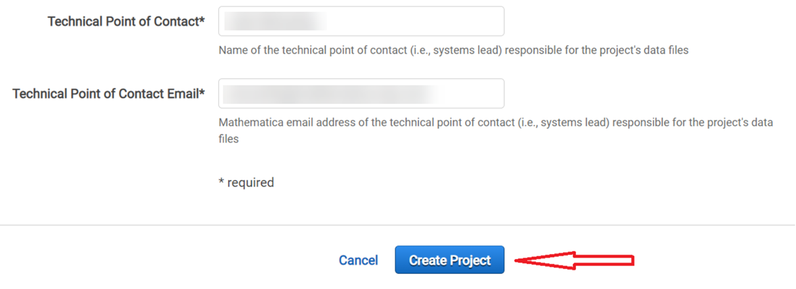
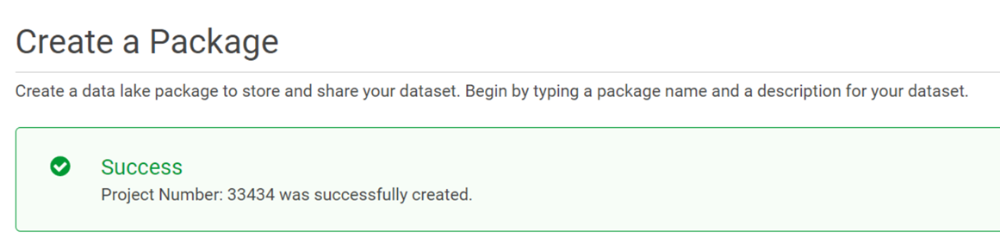
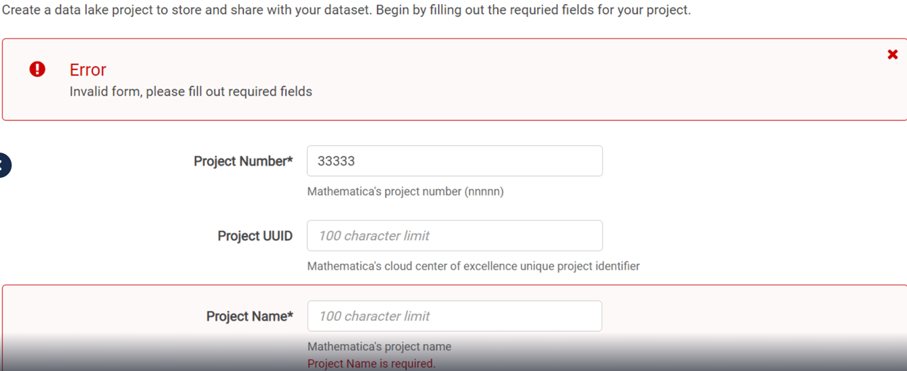

# Onboarding a project 

Project **System Leads** add project details to create and store datasets in the library. The project details serve to enhance the Data Library capabilities and allow to:
- Create metadata for the data files transferred to the Data Library by the project.
- Identify the business and department unit to which the project data belongs.
- Identify any security requirements for the project, such as the ATO or if the project data files need to be archived/destroyed per the contractual requirements.
- Identify the project Lead to communicate, supervise the project data ingestion process.
- Build a catalog of datasets related to the different focus areas of Mathematica study that data researchers can effortlessly query and explore.

To add the project details,

1. Click **Project Onboard**.
  
2. In the Project Onboarding form, enter all required fields, including the **5 digit project number**, project name, the client associated with the project, the Mathematica unit associated with the project, the project Lead contact details.
  
3. Click **Create Project**.
  
4. On successful creation of a project, you see the options to create a package in the project. See [Creating packages](createpackage.md) for information on how to add metadata for the project datasets using packages.
  
5. If the project onboarding page displays an error (due to missing required fields or fields with invalid data types), enter the required fields and click Create Project again to re-submit the form.
  

> To see a list of all projects in the Data Library, you can search by *Project Number* in the search filter box and see the list of available projects from the dropdown in the search bar. Select a project to view all respective packages within the project.

See below a detailed description of the project onboard fields that you need to complete:

| Field Name | Description |
|------------|--------------|
| Project Number | Mathematica's project number. |
| Project UUID | Mathematica's cloud center of excellence unique project identifier |
| Project Name | The project name. |
| Client Name | Name of the source client associated with the project.  |
| Contract Number | The client's contract number associated with the project. |
| Data Use Agreement Number | The Project's Data Use Agreement number, if the project includes any non-public or restricted use data. |
| Data Use Agreement Expiration Date | The date of Data Use Agreement's expiration date if applicable. This informs whether to archive/destroy the project data based on the DUA requirements. |
| Charge Code | Mathematica's charge code to use for onboarding project into the DataSEAS environment. |
| Project Director | The project director associated with the project. |
| Project Unit | The Mathematica business unit/focus areas  - Health, Human Services, International - associated with the project. On ingestion of data files to the Data Library, dataset is stored in the project unit buckets. |
| Department | The Mathematica division associated with the project. This allows to categorize the data with the business unit. |
| ATO | Indicates if the project data files belong to ATO projects. |
| Technical Point of Contact Name, Email | The project System Lead responsible for the project data files. This person is added to the Data Library Distribution List to receive email notifications when project data users ingest data files. | 
