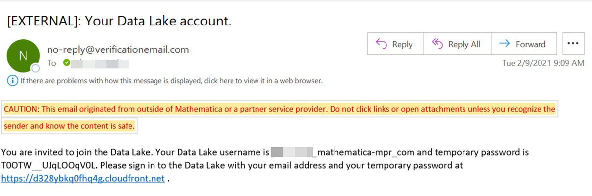

# Requesting access to Data Library

Data scientists, programmers, and analysts interested in using the Data Library for data management,

1. Talk to your Project Director and Project Lead about using the Data Library for managing your data.
2. Project Lead or Directors provides general information about the project and the data requirements through a [Pre-Flight Checklist form](https://mathematicampr.atlassian.net/wiki/spaces/DATASEAS/pages/1112507445/Pre-Flight+Checklist). The form captures information to determine the different data, processing and security requirements of projects and continuously improve the Data Library capabilities. 
3. The Data Library product owners, librarians review the information to confirm if the project data management requirements align with the current capabilities of the Data Library, and can be considered as a candidate for the Data Library.

4. When the project request is approved, the project Systems Lead sends an email request to DS-LibrarySupport@mathematica-mpr.com requesting Data Library access for a list of project users. 
  * The list of project users that need data library access.
      Name (First and Last name of the user)
      Mathematica email address
      User role. The library roles include System Lead (leads project setup, manage user and data access), Developer (adds metadata and datasets), Researcher (view datasets).
  * The list of project users that need data processing access (JupyterHub and GitHub repo).
  * List of Python packages that need to be installed in JupyterHub.
  * The request should also include
      Project Number and Name
      Project Unit
      Approximate storage capacity required

5. The list of project users should include their name, email address and role (System Lead, Developer, Researcher).
6. The Data Library Systems Librarian creates user accounts for the project team and adds the project System Lead to the Data Library ingestion notification email list.
7. The project team members (including the System Lead, developers, researchers) receive email invitations with the user name, the temporary password, and the URL to access the Data Library application. **NOTE: Be sure to use your email address instead of the username that appears in this email.**
  
8. The project team members register their account using the URL in the email - enter the email, temporary password and a new user password for the Data Library account. This allows the members to sign in to the Data Library.

> Bookmark the Data Library URL.
