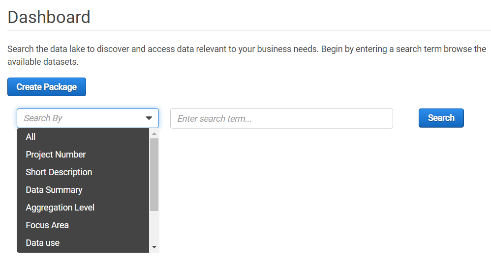
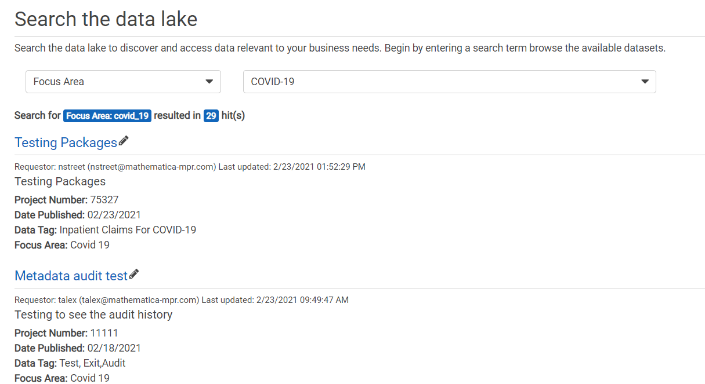
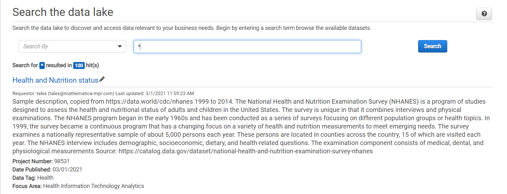
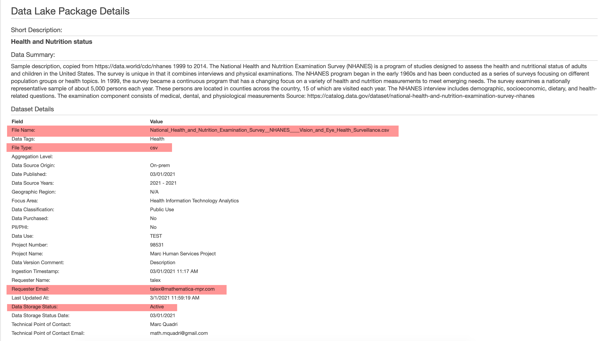

# Searching for packages (for datasets)

Once the data is cataloged through packages, it is automatically indexed by the Data Library search engine. Users can search and browse the packages available in the Data Library.

* Click the **Search** tab or the **Dashboard** to use the search box.

> While you can view all the datasets available in the Data Library, you should edit only the dataset packages that you created. System Leads can edit all dataset packages of a project that they supervise and created.

**Wildcard search**

* To view all packages in the library, enter `*` in the search box, and click **Search**.
   
* To search for all packages that contain words that start with **test\***, enter `test*` in the search box and click **Search**. This wildcard search would return a list of all the packages in the data library with a title, description or metadata that contain the words starting with **test\***.

**To search using the filters**: The Search by filter lets you search using the metadata filters such as Project Number, Aggregation Level, Focus Area, and so on.
   
* Select a filter from the *Search by* dropdown.
* Enter the search term in the search box or select from the search dropdown for the options selected for the filter. For example, to search for packages that are related to COVID-19 studies, select **Focus Area** in the search filter, and then select **COVID-19**. Or to search for data tags that interest you, select **Data Tags** in the search filter, and then enter the data tag term.
* Click **Search**. This search would return a list of packages specific to the search filter.

### Reading package details

* On a search, you see the list of packages associated with the search term.
* Every package result would list 

    * the name of the package
    * additional information of the dataset
    * the project number to indicate the project that the package belongs to
    * the name and contact details of the package owner
    * the date the package is created
    * the data tags if any
    * the focus area of the package.

   

* To view the package details, click the **package name**. You see more information on the dataset such as the name of the dataset, the file type, the person who ingested the dataset.
   
   
   To know more about the dataset and to access it, contact the person who ingested the dataset. 
> This is the manual process in the MVP implementation. We are working on improving the dataset view and access request process in the future implementations.

* If you wish to update the packages associated with your project, use the Edit button next to the project name to open the package in the edit mode.  Refer to [Editing a package](editpackage.md) on how to update the packages.

